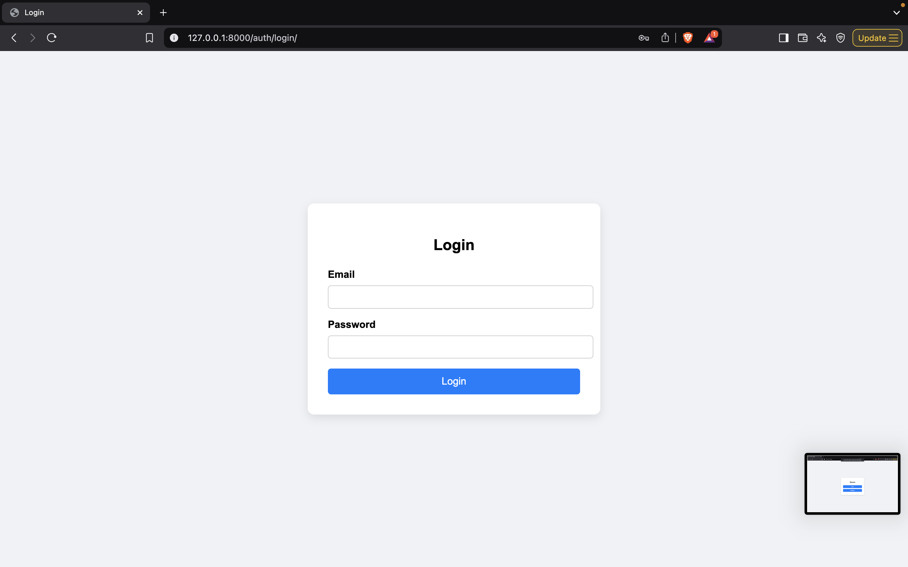
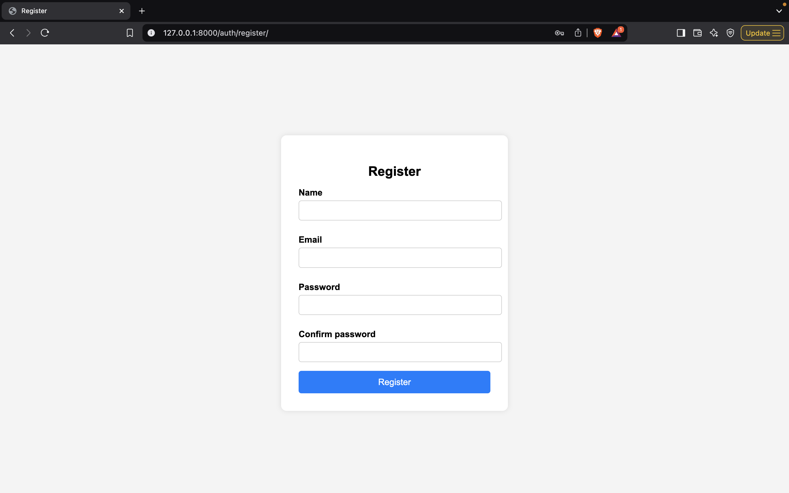
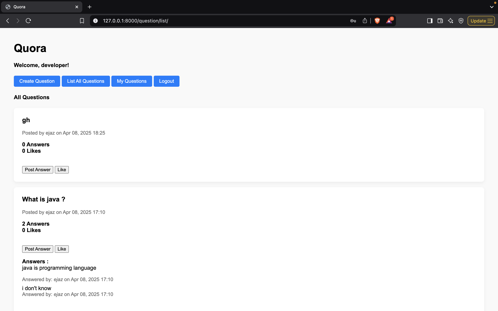
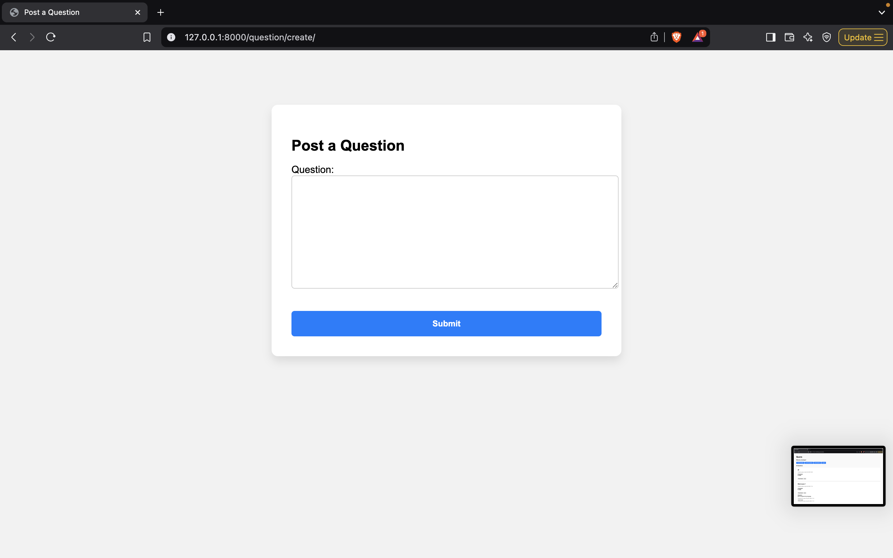
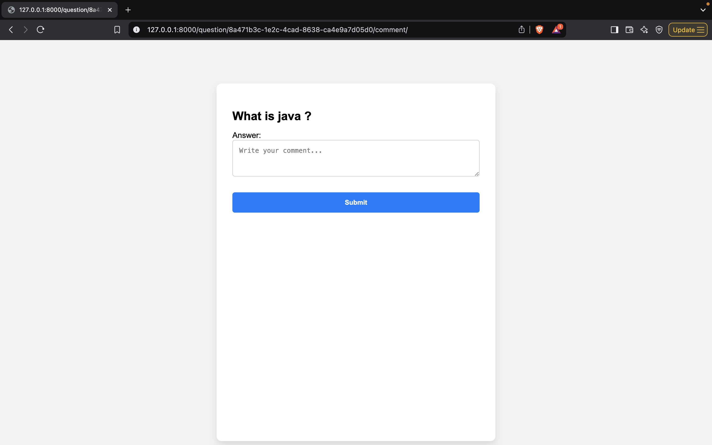

# Django Q&A Platform

A simple Question & Answer web app built using **Django**, featuring user registration, login, logout, question posting, commenting, and likes.

## 🚀 Features

- User Registration & Authentication
- Post Questions
- Answer Questions
- Like/Unlike Questions
- Track Likes and Comment Counts
- Display Recent Answers & Activity
- Basic UI Styling with HTML/CSS
- Template Inheritance with `header.html`

## 🛠️ Tech Stack

- Python 3.x
- Django 4.x
- PostgreSQL
- HTML/CSS


## ⚙️ Setup Instructions

1. **Clone the repository**
   ```bash
   git clone git@github.com:Mr-Vikas111/django_assignment_quora_project.git
   cd quora_posts

2. **Create a virtual environment**
   ```bash
   python -m venv env
   source env/bin/activate  # on Windows: env\Scripts\activate

3. **Install dependencies**
   ```bash
   pip install -r requirements.txt

4. **Run migrations**
   ```bash
   python manage.py migrate

5. **Start the development server**
   ```bash
   python manage.py runserver

6. **Access in browser**
   ```bash
   python manage.py runserver

7. **Access in browser**
   ```cpp
   http://127.0.0.1:8000

## 📸 Screenshots

### 🔐 Login Page


### 🔐 Register Page


### 📝  Question Listing Page


### 📝 Create Question


### 💬 Post Answer


